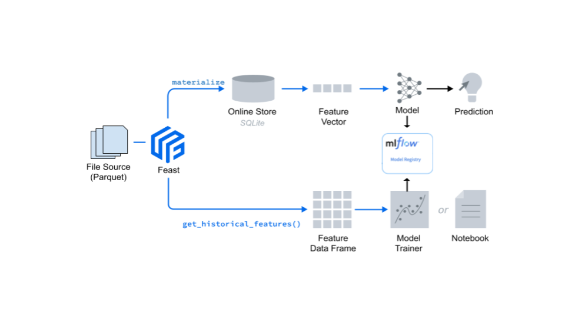

### Module 2
Built upon what you learned in Module 1, we will primarily see how the key Feast concepts and Feast are put to use.
In particular, we'll focus on:

 * introduce [MLflow](https://mlflow.org/docs/latest/concepts.html) concepts and how you can use it for machine learning models
 * fetch training data from our offline store, a local feature store offline store as a Parquet file 
 * train a simple linear regression model
 * use [MLflow](https://mlflow.org/) to track our [experimental runs](https://mlflow.org/docs/latest/tracking.html) and register the model with the [MLflow Model Registry](https://mlflow.org/docs/latest/model-registry.html)
 * navigate the MLflow UI, examine training runs, and register a model
 * fetch feature vector for a list of drivers and predict which is the best ranked driver 



### Setup and Installation

#### Step 1:
Activate the conda environment used in Module 1

``` conda activate feast_workshop ```
#### Step 3: 
Install the latest MLflow

``` pip install mlflow ```
#### Step 4:
``` mlfow --version ```

mlflow, version 1.18.0

#### Step 5: Train the model

Let's view the source to see what it does and how.

```cd <your_cloned_git_dir>/feast_workshops//module_2```

``` python train_model.py```

#### Step 6: Launch MLflow UI 

```mlflow ui --backend-store-uri sqlite:///mlruns.db```

Connect to local host at `http://127.0.0.1:5000`

 1. Peruse the Experiments tab to see all your runs in the MLflow run page
 2. Click on a particular run and see all MLflow entities tracked:
    1. parameters, metrics, tags, descriptions, source, etc
    2. observe the artifacts created, models, signature, Feast features logged, etc
 3. Register and create the registered model with a name: `sklearn_feast_model`

#### Step 6: Make the prediction 

Let's predict, among the list of drivers, who's likely to complete the trip and best ranked

```cd <your_cloned_git_dir>/feast_workshops//module_2```

``` python predict_model.py```

<hr style="border:3px solid gray"> </hr>

Alternatively, you could do all the above steps inside a Jupyter Notebook

### Step 1: Run from Jupyter notebook
```cd <your_cloned_git_dir>/feast_workshops/module_2```

```jupyter lab train_and_predict.ipynb```

